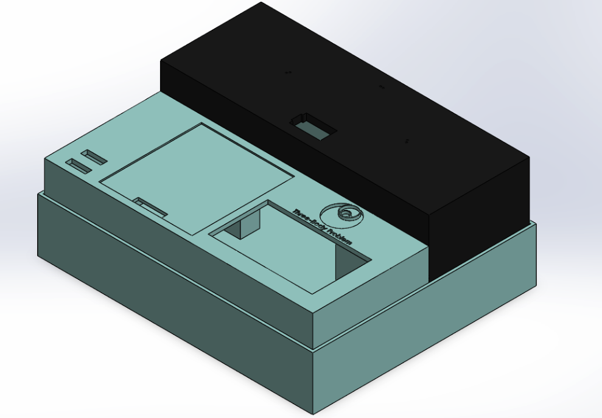
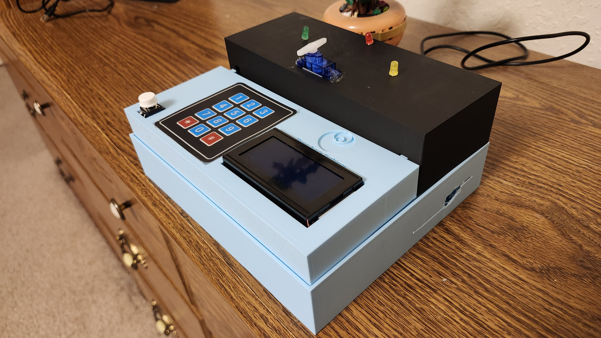
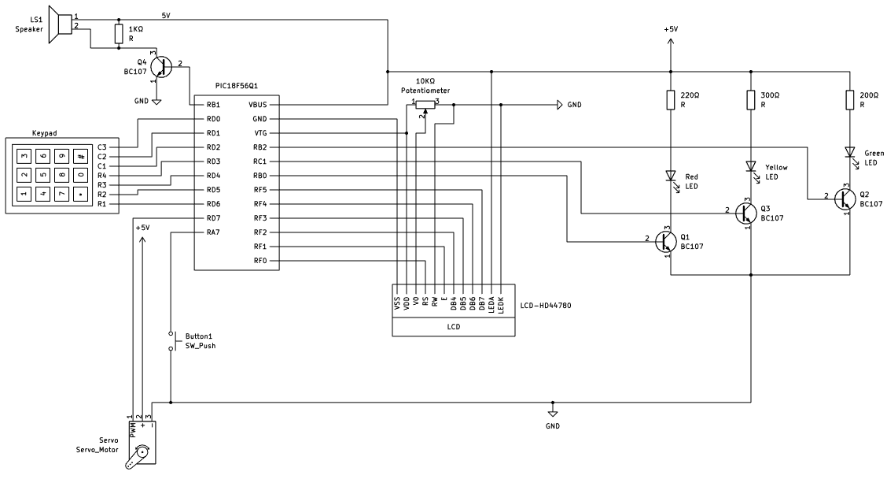
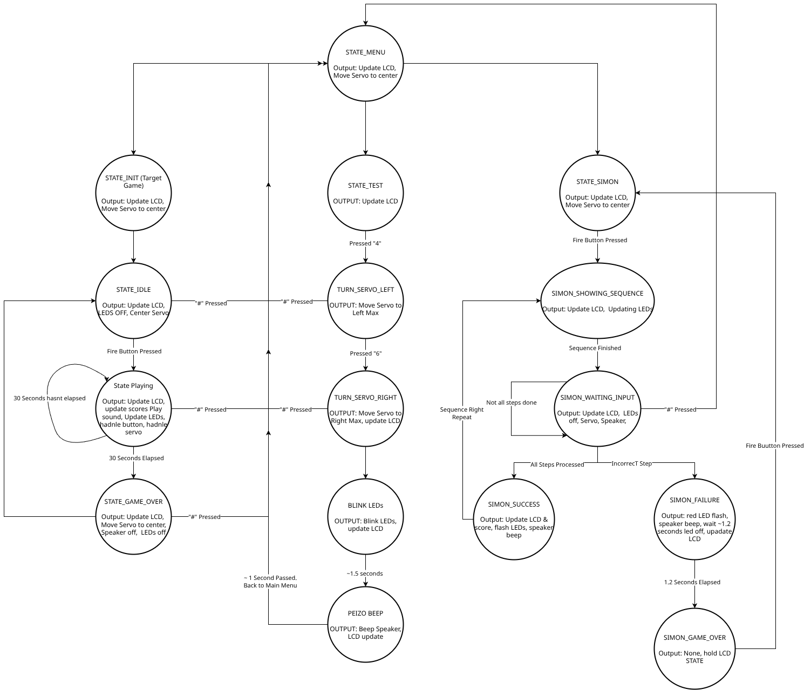

# EGR 227 Final Project

This project is a simple arcade machine using embedded microcontroller **PIC18F56Q71** to run two games: a target shooting game and a Simon Says memory game. The project utilizes various peripherals including buttons, a keypad, an LCD display, RGB LEDs, a servo motor, and a speaker to create an interactive gaming experience. This repository contains the source code, hardware schematics, and documentation for the project. Using this repository a user can build and run the arcade machine on their own hardware setup. 

## Images of the Project
### Project Model in Solidworks
This is a Solidworks assembly model of the project without any electronical components or wiring; just the 3D printed shells for the project.


### Project In Real Life
This is an image of the completed project with all the electronic components.


### Electrical Schematic
This is the electrical schematic of the project created using KICAD.


### State Diagram
This is the final state diagram of the project showing all the states and transitions between them.


## Project Structure

### File Tree
```
├── assets
│   ├── imgs
│   │   ├── 20251207_191956.jpg
│   │   ├── 20251207_192033.jpg
│   │   ├── 20251207_192102.jpg
│   │   ├── 20251207_192118.jpg
│   │   ├── 20251207_192130.jpg
│   │   ├── 20251207_192202.jpg
│   │   ├── 20251207_192209.jpg
│   │   ├── 20251207_192219.jpg
│   │   ├── 20251207_202755.jpg
│   │   ├── model.png
│   │   └── schematic.png
│   ├── models
│   │   ├── Assembly_all.SLDASM
│   │   ├── floor.SLDPRT
│   │   ├── floor.STL
│   │   ├── input-table.SLDPRT
│   │   ├── input-table.STL
│   │   ├── led-servo_table.SLDPRT
│   │   └── led-servo_table.STL
│   ├── FINAL-state-diagram.drawio.png
│   ├── GUI-state-diagram.drawio.png
│   ├── SIMON-state-diagram.drawio.png
│   ├── STATE_PLAYING.drawio.png
│   ├── target-game-state-diagram.drawio.png
│   └── TEST-state-diagram.drawio.png
├── schematic
│   ├── hd44780.kicad_sym
│   ├── schematic.kicad_pcb
│   ├── schematic.kicad_prl
│   ├── schematic.kicad_pro
│   └── schematic.kicad_sch
├── src
│   ├── button
│   │   ├── button.c
│   │   └── button.h
│   ├── gui
│   │   ├── gui.c
│   │   └── gui.h
│   ├── keypad
│   │   ├── keypad.c
│   │   └── keypad.h
│   ├── lcd
│   │   ├── lcd.c
│   │   └── lcd.h
│   ├── led
│   │   ├── led.c
│   │   └── led.h
│   ├── servo
│   │   ├── servo.c
│   │   └── servo.h
│   ├── simon
│   │   ├── simon.c
│   │   └── simon.h
│   ├── speaker
│   │   ├── speaker.c
│   │   └── speaker.h
│   ├── state
│   │   ├── state.c
│   │   └── state.h
│   ├── test
│   │   ├── test.c
│   │   └── test.h
│   ├── timer
│   │   ├── timer.c
│   │   └── timer.h
│   ├── hardware.h
│   ├── main.c
│   └── readme.md
├── readme.md
├── report.pdf
└── schematic.pdf
```

### Folders
- `src`: Contains all source code files for the project, including C source files and header files.
- `assets`: Contains images and state diagrams used in the project documentation.
- `schematic`: contains the KICAD schematic files for the hardware design.

### Files
- `readme.md`: This file, providing an overview of the project structure and module descriptions
- `report.pdf`: The final project report detailing the design, implementation, and testing of the project.
- `schematic.pdf`: A PDF export of the KICAD schematic for easy viewing.